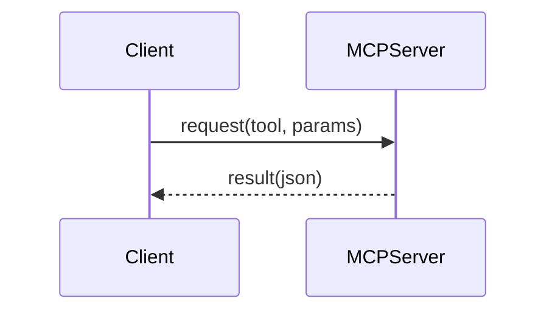

# Contributing to the MCP Website

Thanks for helping improve the Model Context Protocol (MCP) website. This is a content‑first project focused on practical, real‑world guidance: clarifying limitations and misconceptions, sharing patterns, and documenting useful tools and setups.

The site runs Docusaurus in blog‑only mode. Most contributions are MDX blog posts.

## Ways to Contribute

- Write a blog post (best practices, patterns, anti‑patterns, case studies)
- Improve clarity, examples, or fix typos
- Propose navigation or UX improvements
- Report bugs or content inaccuracies

## Prerequisites

- Node.js 20 or newer
- Package manager (bun preferred)

Local setup:

```
bun install
bun run start
```

Preview production build:

```
bun run serve
```

## Content Contributions (MDX posts)

1) Create a file under `blog/` using `YYYY-MM-DD-title.mdx`.

2) Add front matter (required fields below):

```mdx
---
slug: mcp-misconceptions
title: Common Misconceptions about MCP
description: Clarifying what MCP does—and doesn’t—do in practice.
authors: [your-id]
tags: [mcp, patterns]
# optional
image: /img/og/mcp-misconceptions.png
draft: false
---
```

3) Author profile. If you’re new, add yourself to `blog/authors.yml`:

```yaml
your-id:
  name: Your Name
  title: Your Role / Org
  url: https://your-link.com
  image_url: https://your-avatar.png
  page: true
  socials:
    x: yourhandle
    github: yourgithub
    linkedin: yourlinkedin
```

4) Images. Place assets in `static/img/` and reference as `/img/<file>`.

- Prefer `.webp` or optimized `.png`
- Add descriptive `alt` text
- Keep images < 1600px wide and < 1MB where possible

5) Tags. Reuse existing tags in `blog/tags.yml` when possible. Add new tags if needed.

## MDX Guidelines

- Don’t start with an `# H1` (the page title comes from front matter)
- Use clear sections with `##` and `###`
- Include small, runnable examples where helpful
- Use code fences with a language, e.g. ` ```json`, ` ```ts`
- Admonitions:

```mdx
:::tip
Keep examples small and runnable.
:::
```

- Mermaid diagrams are supported:

```

```

- Link to official references where relevant:
  - Docs: https://docs.mcp.com.ai
  - HAPI Server: https://hapi.mcp.com.ai
  - Run MCP: https://run.mcp.com.ai

## Pull Request Process

1) Create a branch: `content/mcp-<topic>` or `site/<change>`
2) Ensure it builds and previews locally
3) Open a PR with:
   - What changed and why
   - Screenshots for visual changes
   - Checklist (below)

PR checklist:

- [ ] Front matter includes `title`, `description`, `authors`, `tags`
- [ ] New author added to `blog/authors.yml` (if needed)
- [ ] Images optimized and referenced from `/img/...`
- [ ] Local `bun build` succeeds and pages render correctly

## Site / Code Changes

- Navigation and links: `docusaurus.config.ts`
- Global styles: `src/css/custom.css`
- Theme overrides and components: `src/theme/`, `src/components/`

Keep changes minimal and consistent with the existing style. Use TypeScript where present and avoid introducing new dependencies unless necessary.

## Reporting Issues

Open an issue with a clear title and include:

- What is wrong or unclear
- Affected page URL or file path
- Proposed fix or example, if available

## Legal

By contributing, you agree your contributions are licensed under the project’s MIT License (see `LICENSE`). Do not include secrets or proprietary content without permission.

