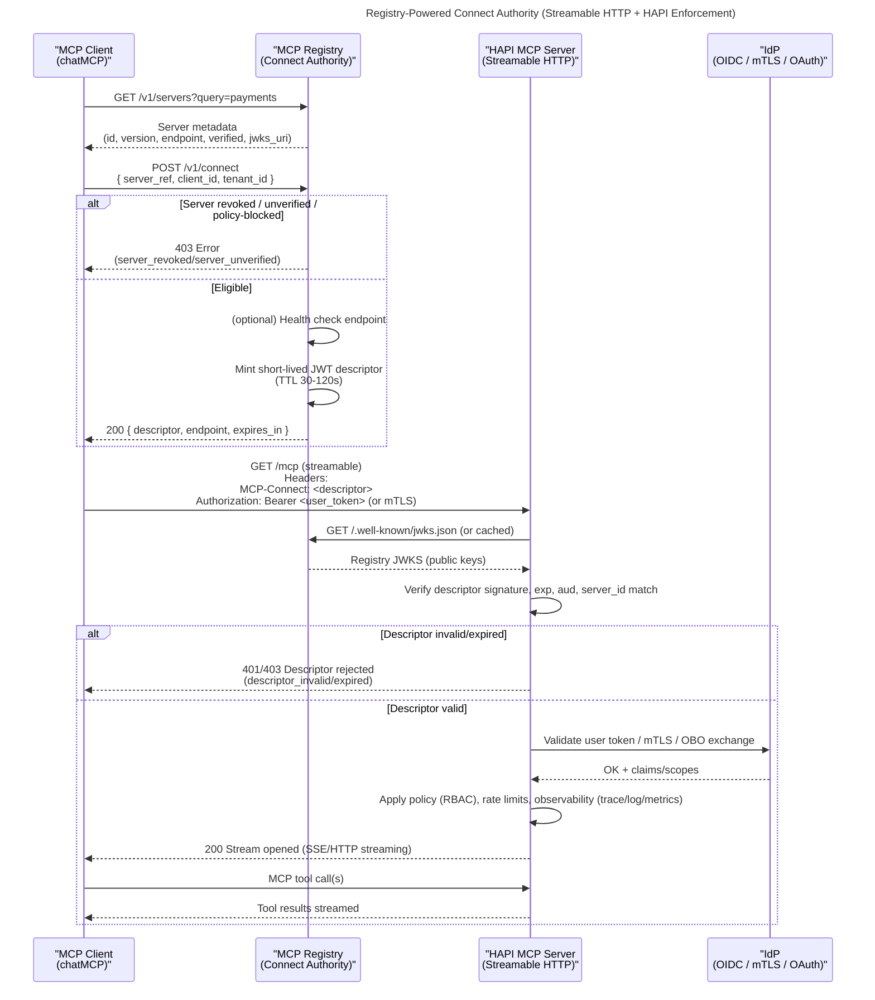

The [MCP Registry](https://registry.modelcontextprotocol.io) is designed as a centralized catalog and metadata service for MCP (Model Context Protocol) components. It provides discovery, verification, and governance capabilities for MCP clients and servers. The *HAPI MCP Registry* does not proxy traffic; instead, it acts as a **mcp connection authority**, issuing short-lived **mcp connect descriptor** tokens that authorize clients to connect directly to MCP Servers.

<!-- truncate -->

### The Architectural Dilemma: MCP Registry vs Gateway

At a high level, architects face a choice: treating the Registry as a control-plane for discovery and governance, or deploying a Gateway to sit on the data-plane and proxy traffic. This article argues for a **registry based mcp architecture** — one that provides robust **mcp connection governance** without the operational overhead of a gateway.

We will explore **mcp gateway alternatives** such as connect-authority issuance and distributed enforcement, demonstrating why this **mcp connection authority** model is often the superior choice for scalable, secure AI systems.

<!-- truncate-->

AI-native applications require scalable, secure, and manageable architectures. **Just as with microservices**, the same security and governance principles apply to MCP-based systems. Throughout MCP's brief yet rapid evolution, [security breaches](https://authzed.com/blog/timeline-mcp-breaches) and failures have taught us valuable lessons. In response, the MCP Registry was created, offering developers a dependable, community-driven platform to discover and share MCP servers, all while ensuring security and building trust.

What the official MCP Registry actually promises today:

The official MCP Registry was launched as an open catalog + REST API for discovery and standardized metadata, with moderation and namespace verification. It is explicitly positioned as a "single source of truth" that sub-registries build on.

Key constraints that matter for a gateway discussion:

* It's metadata, not package hosting.
* It's designed primarily for programmatic consumption by sub-registries, not end-users/clients directly (at least today).
* Security scanning is delegated to package registries and/or sub-registries in the MVP.
* The API went into an "API freeze" period (v0.1), signaling stability, but it's still evolving toward GA.

The Registry can enable a gateway, but it's not trying to be one.

## Why not a Gateway?

*"Can the MCP Registry become an MCP Gateway?"*

That question hides a deeper one:

> **Can we get gateway-level control without turning the Registry into a fragile, high-risk data plane?**

The answer is **yes** — *if we're precise about what a gateway actually is*.

### Why not proxy MCP traffic?

Proxying MCP traffic creates a central data-plane that inspects or routes every session. That introduces latency, inspection risks, and operational complexity. A better approach for many deployments is to avoid proxying and rely on **mcp connect descriptor** issuance and server-side validation. This keeps the control plane (the Registry) strictly separate from the data plane.

## Control-Plane vs Data-Plane in MCP

First of all, we need to clarify what a gateway *usually* means. This distinction is critical for understanding **mcp control plane architecture** versus **mcp data plane design**.
### A Registry is usually **control-plane**

It answers questions like:

* What exists?
* Where does it live?
* What does it support?
* Who owns it?
* Is it verified?
* Is it allowed?

Think: **catalogs, metadata, governance, discovery**.

### A Gateway is usually **data-plane**

It answers questions like:

* I connect to *one* endpoint
* Traffic flows *through* it
* It authenticates
* It enforces policy
* It rate-limits
* It observes
* It transforms

Think: **proxying, routing, runtime enforcement**.

Most gateway designs fail not because gateways are bad — **but because they are asked to do *everything*.**

### Do you need an MCP Gateway?

The short answer is: often, no.

If your requirements involve centralized deep packet inspection (DPI), inline payload transformation, or legacy protocol translation, a gateway is necessary. However, for **secure mcp server discovery**, runtime governance, and revocation, a **Connect Authority** is more efficient.

**Connect Authority vs Gateway**:
A gateway intercepts and mediates data-plane traffic, introducing latency and a single point of failure. A Connect Authority mediates *permissions* and *discovery* in the control plane. By issuing **mcp connect descriptor** artifacts, it enables **mcp connection governance** without the heavy lift of inline proxying.

So the real architectural question becomes:

> **Can we give the MCP Registry "gateway power" without making it a gateway?**

Yes — if we redefine what "gateway" means.

---

## The key insight: connection authority ≠ traffic proxy

Here's the mental flip:

* A **gateway** doesn't need to see traffic to control *who is allowed to connect*
* Runtime enforcement doesn't need to be centralized
* Moderation doesn't need a proxy to be effective

What you actually want is **connect-time authority**, not a data-plane choke point.

In this model:

* The Registry governs **who may connect**
* The server enforces **what happens after**
* The client performs **one extra, intentional step**

This is where the MCP Registry becomes something more subtle — and more powerful.

---

## The Registry as a connection resolver

Instead of proxying traffic, the Registry transforms into a **Connect Authority**. It becomes a control-plane gateway that facilitates **secure MCP server discovery**.

Clients query the Registry to find verified servers ("discovery"). But before they can connect, they must request permission. This turns the Registry into a policy engine that answers one critical question:

> *"Are you allowed to connect to this server right now?"*

If yes → it issues a signed proof (descriptor).
If no → the connection never starts.

This approach is comparable to **DNS + app store metadata**—but with enforcement capabilities.

---

## The Connect Descriptor (the "boarding pass")


This is the missing primitive.

A **Connect Descriptor** is a:

* short-lived
* signed
* connect-time token
* issued by the Registry
* consumed by the client
* validated by the server

It contains:

* the **actual server endpoint**
* the **transport** (streamable HTTP only)
* the **server identity**
* an **expiration window**

### Think: *boarding pass*, not *passport*

* It doesn't identify the user
* It doesn't authorize tool usage
* It doesn't replace authentication

It simply says:

> *"You are allowed to attempt a connection to this server right now."*

That's it.

And that's enough.

---

## Why this extra client step matters (and why it's intentional)

Yes — this introduces an extra step for clients.

And that's the entire point.

### Old model (direct connect)

```
Client → Server URL → Tools
```

* Fast
* Simple
* Ungoverned
* Irrevocable
* No verification boundary

But we already know the risks of this model:

* unverifiable endpoints
* unmoderatable servers

**If security and governance matter, this model falls short.**

### New model (governed connect)

```
Client → Registry → Descriptor → Server URL → Tools
```

That one hop unlocks:

* runtime-effective moderation
* revocation without proxies
* endpoint integrity
* server identity pinning
* version & transport guarantees

Clients that skip this step *can still connect* — but they explicitly opt out of governance.

This mirrors OAuth perfectly:

* You can skip OAuth
* You just lose its guarantees

---

## Why streamable HTTP only changes everything

This model works **because** we constrain transport.

By supporting **remote, streamable HTTP only**:

* No stdio bridging
* No local process trust
* No transport ambiguity
* No hidden execution contexts

Every MCP server is:

* already running
* already reachable
* already enforcing policy

That's where **[HAPI MCP](https://hapi.mcp.com.ai) Servers** come in.

---

## Distributed enforcement MCP: why HAPI makes this viable

The Registry doesn't enforce runtime security directly—and that is a feature, not a bug.

This aligns perfectly with a **Zero Trust MCP architecture**. In a Zero Trust model, we never trust an endpoint based solely on network location. Instead, we require a valid, short-lived **mcp connect descriptor**.

Because **HAPI MCP Servers** act as the data-plane enforcement points, they handle:

* authentication termination
<!-- * policy enforcement -->
* rate limiting
* observability
* token mediation / exchange

This lets us distribute enforcement *to the edge*. The Registry decides **if a connection may exist**, while the HAPI server decides **what happens inside that connection**.

No proxy needed.

---

## MCP Governance Without a Gateway

### Making moderation runtime-effective

Here's the critical trick:

### Stop issuing descriptors.

That's it.

If a server is revoked or moderated out:

* the Registry refuses to issue new Connect Descriptors
* well-behaved clients cannot connect
* no traffic flows
* no proxy is involved

Want stronger enforcement?

### Descriptor refresh (hard cutoff)

Descriptors are short-lived (configurable TTL, e.g. 30-120s).

HAPI can require clients to:

* refresh the descriptor periodically
* fail the session if refresh fails

Now moderation becomes **hard runtime shutoff**:

* revoke server
* no new descriptors
* active sessions expire naturally

Still no gateway.

---

## What this architecture avoids (by design)

This is what we *intentionally* don't do:

* No central proxy
* No data-plane bottleneck
* No secrets stored in the Registry
* No traffic inspection
* No latency tax
* No single point of failure

The Registry stays:

* scalable
* safe
* boring (in a good way)
* reliable
* trustworthy
* low-risk

---

## The full flow (putting it all together)



1. Client discovers a server in the Registry
2. Client requests a Connect Descriptor
3. Registry checks verification, moderation, compatibility
4. Registry issues a short-lived descriptor
5. Client extracts the endpoint from the descriptor
6. Client connects **directly** to the HAPI server
7. HAPI validates the descriptor
8. HAPI authenticates the user
9. HAPI enforces policy and executes tools
10. Descriptor refresh keeps governance live

Discovery is centralized.  
Enforcement is distributed.  
Connections are governed.  

---

## Why this scales (technically and socially)

Technically:

* no proxy bottlenecks
* no hot path in the Registry
* horizontal scalability
* zero trust friendly

Socially:

* communities can build clients incrementally
* enterprises get governance without lock-in
* server authors keep autonomy
* moderation has real impact

---

## The final takeaway

You don't turn the MCP Registry into a gateway by adding more features.

You do it by **not turning it into one at all**.

By making it a **connection authority**, you get:

* gateway-level control
* without gateway-level risk

And that's the difference between a system that scales — and one that collapses under its own ambition.

*Be HAPI*, and stay tuned for more MCP architecture deep dives. Go Rebels! ✊🏼
