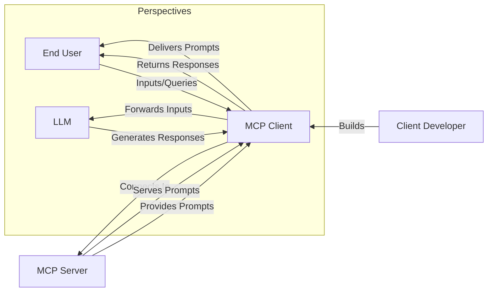

# MCP Threats and Prompt Injection: What You Must Know

Prompt injection is a critical security risk for any system using large language models (LLMs), including those built with Model Context Protocol (MCP). You must understand how prompt injection works, why MCP cannot prevent it, and what steps you should take to protect your users and applications (MCP Clients).

<!-- truncate -->

## Introduction

MCP enables users and clients to discover and pull prompts from MCP Servers. This flexibility means you, as a client developer, are responsible for validating and sanitizing all user inputs before they reach the LLM. MCP Clients act as intermediaries between MCP Servers, end users, and LLMs. If you do not implement proper validation, malicious prompts can reach the LLM and cause harmful or unintended outputs.

:::warning
Prompt injection is recognized as a top risk by OpenAI ([OpenAI Prompt Injection Guide](https://platform.openai.com/docs/guides/prompt-injection)), Anthropic ([Anthropic Prompt Injection FAQ](https://www.anthropic.com/index/prompt-injection)), and OWASP ([OWASP AI Security Top 10](https://owasp.org/www-project-top-10-for-large-language-model-applications/)).
:::

## How Prompt Injection Works in MCP

**Key Roles:**
- **Client Developer:** You build MCP Clients and must implement security and validation.
- **MCP Client:** Your app acts as an intermediary, handling prompt delivery and user input forwarding.
- **End User:** Users interact with LLMs via MCP Clients and may provide inputs that could be exploited.
- **LLM:** Processes prompts and user inputs, vulnerable to prompt injection if upstream validation is insufficient.

## Threats

Prompt injection can lead to several serious risks:

- **Malicious Prompts:** Attackers craft prompts to manipulate the LLM into generating harmful or unintended outputs ([OpenAI](https://platform.openai.com/docs/guides/prompt-injection)).
- **User Input Manipulation:** End users may input data designed to exploit vulnerabilities in the LLM's response generation ([Anthropic](https://www.anthropic.com/index/prompt-injection)).
- **Data Leakage:** Sensitive information may be exposed through manipulated prompts or responses ([NIST AI RMF](https://airmf.nist.gov/)).
- **Reputation Damage:** Misleading outputs generated by LLMs due to prompt injection can harm your application's reputation.

## Common Misleadings

Avoid these misconceptions:

- **False Sense of Security:** MCP does not provide inherent protection against prompt injection. You must implement your own safeguards.
- **Overreliance on LLMs:** LLMs do not automatically handle all types of inputs safely. Validation is essential.
- **Misunderstanding Roles:** Security measures must be implemented in the MCP Client, not just the server or LLM.
- **Assumption of Trustworthiness:** Do not trust all prompts from third-party MCP Servers. Use official or self-hosted servers when possible ([OWASP](https://owasp.org/www-project-top-10-for-large-language-model-applications/)).
- **Neglecting Client Responsibility:** Input validation is your responsibility as the MCP Client developer.

## Mitigation Strategies

Follow these best practices to reduce prompt injection risks:

1. **Input Validation:** Check all user inputs for malicious content before forwarding to the LLM ([OWASP](https://owasp.org/www-project-top-10-for-large-language-model-applications/)).
2. **Sanitization:** Remove or neutralize potentially harmful elements in user inputs.
3. **User Education:** Inform users about prompt injection risks and safe input practices.
4. **Regular Audits:** Audit your MCP Client regularly to identify and fix vulnerabilities.
5. **Monitoring and Logging:** Track interactions and flag suspicious activities for review.

## References

- [OpenAI: Prompt Injection Guide](https://platform.openai.com/docs/guides/prompt-injection)
- [Anthropic: Prompt Injection FAQ](https://www.anthropic.com/index/prompt-injection)
- [OWASP: Top 10 for LLM Applications](https://owasp.org/www-project-top-10-for-large-language-model-applications/)
- [NIST: AI Risk Management Framework](https://airmf.nist.gov/)

By understanding and addressing these threats, you can secure your MCP Client against prompt injection vulnerabilities and protect your users and reputation.