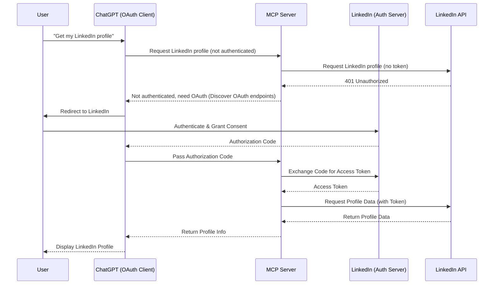

import Head from '@docusaurus/Head';
import ReactPlayer from 'react-player';

export const faqJsonLd = {
   "@context": "https://schema.org",
   "@type": "FAQPage",
   "mainEntity": [
      {
         "@type": "Question",
         "name": "What is 3-Legged OAuth2 in MCP apps?",
         "acceptedAnswer": {
            "@type": "Answer",
            "text": "It is the OAuth2 Authorization Code Flow where users grant consent to AI clients like ChatGPT or Claude, and MCP servers access APIs securely without user passwords."
         }
      },
      {
         "@type": "Question",
         "name": "Why is Authorization Code + PKCE recommended for MCP?",
         "acceptedAnswer": {
            "@type": "Answer",
            "text": "Authorization Code + PKCE reduces token interception risks and is the standard secure pattern for delegated access in modern AI and enterprise applications."
         }
      },
      {
         "@type": "Question",
         "name": "Do ChatGPT and Claude need custom OAuth logic for each provider?",
         "acceptedAnswer": {
            "@type": "Answer",
            "text": "No. They operate as OAuth clients using standardized flow mechanics, while the MCP server manages provider-specific token exchange and secure access."
         }
      },
      {
         "@type": "Question",
         "name": "Does the MCP server store user passwords?",
         "acceptedAnswer": {
            "@type": "Answer",
            "text": "No. Users authenticate directly with the identity provider, and the system works with scoped tokens and consent, not raw credentials."
         }
      },
      {
         "@type": "Question",
         "name": "Is this pattern enterprise-ready for compliance and audits?",
         "acceptedAnswer": {
            "@type": "Answer",
            "text": "Yes. OAuth2 with explicit consent, revocation, token lifecycles, and centralized logging aligns with common enterprise security and audit expectations."
         }
      },
      {
         "@type": "Question",
         "name": "What problem does HAPI MCP solve in OAuth implementation?",
         "acceptedAnswer": {
            "@type": "Answer",
            "text": "HAPI MCP turns OAuth from custom engineering work into configuration by handling authorization flow, token exchange, refresh lifecycle, and MCP-compliant endpoints."
         }
      },
      {
         "@type": "Question",
         "name": "Can I use the same OAuth model across LinkedIn, Strava, and Google MCP servers?",
         "acceptedAnswer": {
            "@type": "Answer",
            "text": "Yes. The core Authorization Code pattern stays consistent across providers, which makes MCP deployments repeatable and easier to scale."
         }
      },
      {
         "@type": "Question",
         "name": "What is the business impact of standardized OAuth in MCP?",
         "acceptedAnswer": {
            "@type": "Answer",
            "text": "It speeds up delivery, lowers engineering overhead, reduces security risk, and improves enterprise adoption by using a trusted authentication standard."
         }
      }
   ]
};

<Head>
   
</Head>

*If your AI agent can access user data without asking for passwords... you win trust. If it can't... you lose the deal.*

If you deploy an MCP Server manually from scratch, OAuth becomes a project.

If you **deploy an MCP Server using HAPI MCP from an OpenAPI specification**, OAuth becomes a configuration option.

That's a little big difference.

<!-- truncate -->

In the AI era, **security is product strategy**.

Every serious MCP implementation will eventually face the same question:

> **How do we let AI clients like ChatGPT or Claude access user data securely — without storing passwords or reinventing OAuth every time?**

The answer isn't new.
It's not exotic.
It's not experimental.

It's **3-Legged OAuth2 — Authorization Code Flow**.

And inside MCP Apps, it becomes even more interesting.

Let's break it down clearly, practically, and from an enterprise-ready perspective.

---

## What Is 3-Legged OAuth2 (Authorization Code Flow)?

3-Legged OAuth2 is the industry-standard way for a third-party application to access user data without the user sharing their password.

The “three legs” represent three actors:

1. **Resource Owner** → The User
2. **Client** → The Application (e.g., ChatGPT, Claude Desktop)
3. **Authorization Server** → The Identity Provider (e.g., LinkedIn, Facebook, Google)

The flow works like this:

1. User clicks “Connect LinkedIn.”
2. The client redirects the user to LinkedIn.
3. The user logs in directly at LinkedIn.
4. LinkedIn asks: *“Do you allow this app to access your data?”*
5. If approved, LinkedIn sends an authorization code back to the client.
6. The client exchanges that code for an access token.
7. The client can now call APIs securely on behalf of the user.

No password sharing.
No credential storage.
No trust leaks.

This pattern is standardized and widely adopted across the internet.

---

## How 3-Legged OAuth Works in MCP Apps

Now here's where things get interesting.

In a traditional web app, the client directly calls the resource server.

In MCP Apps, the architecture introduces a clean separation.

Instead of three actors, you now have **four parties involved**:

1. **Resource Owner** → The User
2. **OAuth Client** → ChatGPT, Claude Desktop, or another MCP Client
3. **Authorization Server** → LinkedIn, Strava, Facebook, etc.
4. **Resource Server** → The MCP Server

Let's visualize this properly.

---

## 🔐 MCP OAuth Applied

Let's see this with a practical example, where a user wants to connect their LinkedIn profile to ChatGPT via an MCP Server.

<ReactPlayer
  src='https://youtu.be/N5rzOtSgmOk'
  style={{ width: '90%', height: 'auto', aspectRatio: '4/3' }}
  controls
/>

---

### Step-by-Step MCP OAuth Flow

1. User tells ChatGPT:
   > “Get my LinkedIn profile.”
2. ChatGPT (OAuth Client) calls the MCP Server, which initiates the OAuth flow when not authenticated.
3. The MCP Server tries to call LinkedIn APIs but gets a 401 Unauthorized response.
4. The MCP Server responds to ChatGPT, indicating that it needs to authenticate via OAuth and provides discovery information about the OAuth endpoints.
5. ChatGPT (OAuth Client) initiates the Authorization Code flow.
6. User is redirected to LinkedIn (Authorization Server).
7. User authenticates and grants consent.
8. LinkedIn issues an authorization code.
9. ChatGPT passes the authorization code back to the MCP Server.
10. The MCP Server handles the token exchange.
11. MCP Server calls LinkedIn APIs with the proper access token.
12. The result flows back:
   LinkedIn → MCP Server → ChatGPT → User.

What changed?

👉 The MCP Server acts as the secure resource boundary.  
👉 The client never sees or stores upstream provider tokens.  
👉 The system remains compliant with OAuth standards.  

This is critical for enterprise use.

You don't need to build custom auth logic for every provider, try [HAPI MCP CLI](https://hapi.mcp.com.ai), or [runMCP](https://run.mcp.com.ai) Server in the cloud from your OpenAPI spec, and the OAuth flow is handled for you.

---

### Why This Pattern Matters for AI Systems

In AI agent ecosystems, we need:

* Delegated access
* Revocable permissions
* Token isolation
* Standard compliance
* No password storage
* Clear separation of responsibility

3-Legged OAuth delivers exactly that.

And because it is standardized, it becomes:

* Repeatable
* Auditable
* Secure by design
* Familiar to security teams

That last point is important.

When you walk into an enterprise environment, the fastest way to get rejected is by inventing custom authentication mechanisms.

Security teams trust OAuth2 Authorization Code Flow.

---

## The Problem Most Developers Face

Here's the friction.

If you build MCP servers manually, you must:

* Implement OAuth redirect endpoints
* Handle authorization code exchange
* Store and refresh access tokens
* Manage token expiration
* Secure client secrets
* Handle PKCE (Proof Key for Code Exchange)
* Deal with multiple providers
* Maintain compliance

That is a lot of surface area.

And every provider behaves slightly differently.

Multiply that across:

* LinkedIn
* Strava
* Facebook
* Google
* Custom enterprise identity providers

Now it becomes operational debt.

---

## The MCP Specification Already Solved This

The Model Context Protocol defines:

* How MCP Clients interact with MCP Servers
* How authentication should be handled
* How standardized discovery endpoints work
* How secure delegation must operate

That means:

> OAuth in MCP is not an afterthought.
> It is part of the protocol design.

This is powerful.

It makes OAuth not just possible — but predictable.

---

## Where HAPI MCP Changes the Game

Now let's talk about implementation reality.

If you deploy an MCP Server manually from scratch, OAuth becomes a project.

If you deploy an MCP Server using HAPI MCP from an OpenAPI specification, **OAuth becomes configuration**.

That's the difference.

HAPI MCP includes:

* Built-in OAuth flow handling
* Authorization Code + PKCE support
* Token exchange management
* Refresh token lifecycle handling
* Secure token isolation
* Standards-compliant MCP endpoints

You don't write the OAuth engine.

You define your OpenAPI spec.

You deploy.

The rest is handled.

**Bonus**: For Greenfield API providers, you can design your API with OAuth in mind from the start, HAPI MCP CLI will generate the necessary scaffolding for you to focus on your core API logic.

---

## What This Means for Builders

Let's answer the most common questions clearly.

---

❓ **Do I need to implement OAuth manually for every MCP App?**

No.

If you deploy via HAPI MCP, the OAuth handling is built-in.

You configure providers.
You deploy your MCP server.
The flow works.

---

❓ **Does ChatGPT or Claude need custom OAuth logic?**

No.

They act as OAuth clients following the standard Authorization Code Flow.

The protocol alignment makes this repeatable.

---

❓ **Is this secure enough for enterprise use?**

Yes — because:

* It follows OAuth2 Authorization Code Flow
* It supports PKCE
* Tokens are isolated
* Passwords are never shared
* Access can be revoked at the provider level

Security teams understand this pattern.

That reduces friction during procurement.

---

❓ **What about compliance and auditing?**

Because the flow is standardized:

* Logs can be centralized
* Access tokens are time-bound
* Consent is explicit
* Revocation is supported

This aligns with regulated industries.

Especially important in:

* Telco
* Banking
* Healthcare
* Government

---

## Business Impact: Why This Matters

Let's translate this from a technical perspective to business language.

🚀 **Faster Time to Market**

No custom OAuth implementation per provider.

💰 **Lower Engineering Cost**

No repeated auth boilerplate across MCP Apps.

🛡️ **Reduced Security Risk**

Standard, battle-tested authentication pattern.

🔁 **Repeatable Deployment Model**

Same OAuth behavior across all MCP servers.

📈 **Enterprise Sales Enablement**

Security teams approve faster when OAuth2 is used correctly.

Authentication is not a feature.

It's an approval accelerator.

---

# A Real Example

Imagine you build:

* A Strava MCP
* A LinkedIn MCP
* A Valorant MCP

Without standardization, each becomes its own **OAuth project**.

With HAPI MCP:

1. Define the OpenAPI spec.
2. Configure OAuth provider.
3. Deploy MCP server.
4. Connect from ChatGPT, Claude, or any compliant client.

Done.

Same pattern.
Same security.
Same behavior.

Repeatable.

---

# The Hidden Strategic Advantage

AI systems are moving toward:

* Agentic workflows
* Tool chaining
* Delegated data access
* Multi-provider integrations

If authentication is inconsistent, your agent ecosystem collapses.

If authentication is standardized, your system scales.

3-Legged OAuth2 is not optional.

It's foundational infrastructure.

---

# Final Takeaway

3-Legged OAuth2 (Authorization Code Flow) is the secure bridge between:

* AI clients (ChatGPT, Claude)
* User data providers (LinkedIn, Strava, etc.)
* MCP Servers
* End users

It is standardized.
It is repeatable.
It is enterprise-approved.

And when deployed via HAPI MCP, it becomes automatic.

No password handling.
No custom auth engine per server.
No authentication chaos.

Just deploy your MCP server from your OpenAPI spec.

OAuth is handled.

Secure by default.
Composable by design.
Ready for AI.

---

If you're building MCP-native systems, the real question is not:

> “Should I implement OAuth?”

It's:

> “How fast can I standardize it across every MCP I deploy?”

Because the future of AI integration belongs to the teams that treat authentication as infrastructure — not an afterthought.

Be the team that gets it right from day one. Be HAPI, and Go Rebels! ✊🏼

## FAQ: 3-Legged OAuth2 in MCP Apps

**Q: What is 3-Legged OAuth2 in MCP apps?**  
A: It is the OAuth2 Authorization Code Flow where users grant consent to AI clients like ChatGPT or Claude, and MCP servers access APIs securely without user passwords.

**Q: Why is Authorization Code + PKCE recommended for MCP?**  
A: Authorization Code + PKCE reduces token interception risks and is the standard secure pattern for delegated access in modern AI and enterprise applications.

**Q: Do ChatGPT and Claude need custom OAuth logic for each provider?**  
A: No. They operate as OAuth clients using standardized flow mechanics, while the MCP server manages provider-specific token exchange and secure access.

**Q: Does the MCP server store user passwords?**  
A: No. Users authenticate directly with the identity provider, and the system works with scoped tokens and consent, not raw credentials.

**Q: Is this pattern enterprise-ready for compliance and audits?**  
A: Yes. OAuth2 with explicit consent, revocation, token lifecycles, and centralized logging aligns with common enterprise security and audit expectations.

**Q: What problem does HAPI MCP solve in OAuth implementation?**  
A: HAPI MCP turns OAuth from custom engineering work into configuration by handling authorization flow, token exchange, refresh lifecycle, and MCP-compliant endpoints.

**Q: Can I use the same OAuth model across LinkedIn, Strava, and Google MCP servers?**  
A: Yes. The core Authorization Code pattern stays consistent across providers, which makes MCP deployments repeatable and easier to scale.

**Q: What is the business impact of standardized OAuth in MCP?**  
A: It speeds up delivery, lowers engineering overhead, reduces security risk, and improves enterprise adoption by using a trusted authentication standard.
