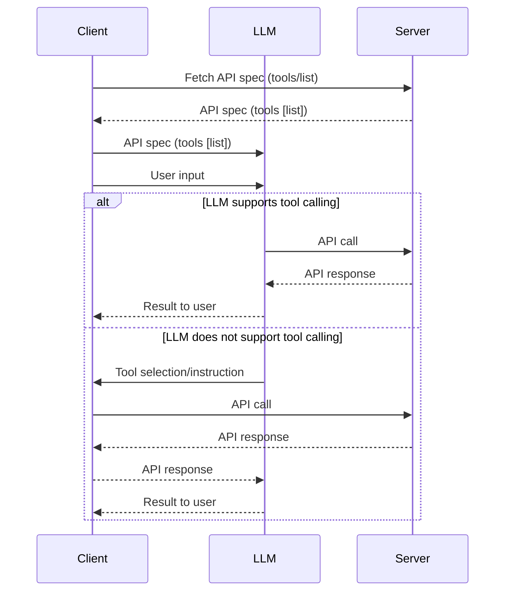

import ReactPlayer from 'react-player'

## OAS v4 Is Out 


🚨 "OpenAPI Specification (OAS) v4 is out" - *That I wish*, this is the kind of headline I would expect to see soon, because OAS can easily be extended to enable RESTful APIs work seamlessly with AI. 

By the end of this article, you'll know how to let any LLM call your REST tools automatically using OAS.

<!-- truncate -->

**What Does It Mean for AI Tool Integration?** Let's explore how OAS v4 could fit into the AI landscape, complementing protocols like Model Context Protocol (MCP). 

:::note  
This is a speculative article about what I would like to see in OAS v4, based on my experience with Model Context Protocol (MCP) and AI tool integration. OAS v4 is not yet released, and this article is not endorsed by the OpenAPI Initiative or any other organization.  
:::

Over the past decade, OAS has become the standard for describing RESTful APIs and is widely adopted across various industries. Now, it's time to expand it to cover AI use cases, addressing the evolving needs of developers.

Model Context Protocol (MCP) has recently gained a lot of attention. It's great for local integrations, allows you to adjust the MCP server for backend connections, and with the latest updates, it can now handle remote calls, moving closer to RESTful APIs. 

Since the beginning [MCP was designed for local integrations mainly](https://rebelion.la/model-context-protocol-mcp-is-it-a-protocol-or-a-contract#heading-the-lsp-connection-understanding-mcps-roots). The breakthrough of MCP lies in its **ability to let the LLM discover the tools available**. This tool discovery feature marks MCP's unique value proposition, transforming the way we approach AI integrations. From there, everything falls into place similar to RESTful APIs: the client acts as a lightweight orchestration layer, the server handles the backend tasks, and the LLM plays the role of the brain, deciding which tools to use and how to use them.

## How does MCP work? For mere mortals

I have noticed that many people struggle to understand how MCP works, so let me try to explain it in a simple way.

Let's imagine a conversation between the client (you), the LLM (a friend), and the server (weather guy):

Setting the scene: you have a person (the MCP Server) who speaks a language you don't understand, such as French, and you have a friend who speaks both languages (The LLM), French and English. You'd like to know the weather in Paris, so you can ask your friend for help. Your friend asks the person in French, gets the answer, and translates it back to you in English. In this scenario, your friend represents the LLM supporting tool calling natively. 

Now, imagine you can write in French but don't speak it fluently. You'd like to know the weather in Paris, but this time you need someone to guide you on what to ask in French. You write the message asking for the weather. Once you receive the answer, you can translate it without help. This scenario reflects the role of an LLM that doesn't support tool calling natively, and the client has to call the tool directly.

Complex, right? Let's see it in a sequence diagram:



The LLM receives a prompt with a description of the [available tools](https://modelcontextprotocol.io/specification/2025-06-18/server/tools#listing-tools). This tool list can be [mapped from the OpenAPI spec](https://rebelion.la/you-dont-need-to-implement-mcp-servers-a-contract-first-approach-to-ai-tool-integration?showSharer=true#heading-example-conversion-openapi-mcp). The LLM then chooses which tool to use and how to use it. The client simply passes the user input to the LLM, which decides what to do next. Some LLMs, like GPT-4-turbo and Llama2, support tool calling natively. Others, like Claude, do not, so the client calls the tool directly, based on the LLM's instruction.

As you can see, either the LLM supports tool calling natively or not, the flow is similar. The only difference is that in the latter case, the client does the call to the server, and forwards the response to the LLM to get the final result for the end-user - based on the LLM's instruction.

## OAS v4 - The missing piece

The missing piece in OAS compared to MCP is that OAS does not have a discovery mechanism for the LLM to know which tools are available. This is where OAS v4 could shine, by adding a way for the LLM to discover the API spec and the available tools.

Imagine if OAS v4 had a way to describe the tools available in a way that the LLM could understand, and then the LLM could decide which tool to use, and how to use it. This would make it possible for any LLM to work seamlessly with RESTful APIs, without the need for a separate protocol like MCP, or even better, MCP could be used as a contract-first approach to AI tool integration, where the OAS v4 spec is the contract that defines the tools available, and the MCP server implements the backend logic. That's precisely what I have been advocating for a while now with my [contract-first approach to AI tool integration](https://rebelion.la/you-dont-need-to-implement-mcp-servers-a-contract-first-approach-to-ai-tool-integration?showSharer=true) and the *Headless API* (HAPI) initiative for MCP.

Now that I have explained how MCP works, and how OAS v4 could be the missing piece, I hope you can see the potential of OAS v4 for AI tool integration. But, don't stop here, next is what I would like to see in OAS v4.

## What You Should Expect in OAS v4

OAS v4 is not just an incremental update—it's an opportunity to rethink how APIs and AI tools work together. Here is what you should expect and advocate for in the next version, based on best practices and the needs of modern AI integrations.

## Modular, Multi-File API Specifications

You need modular specs for real-world APIs. OAS v4 should support multi-file specifications natively, allowing you to break down large APIs into smaller, reusable modules (for example, pets, users, orders). This approach enhances maintainability and collaboration across teams. Instead of a single massive file, you organize your API into logical domains:

- **API Root:** Main file with info, servers, and tags.
- **Security:** Dedicated files for OAuth2 and other schemes.
- **Paths by Domain:** Split endpoints into logical groups (e.g. `pet.api.yaml`, `user.api.yaml`).
- **Components/Models:** Reusable schemas separated by domain.

This modular structure keeps specs manageable (500–1000 lines each) and enables code generators and clients to see one unified spec. Tools like [Redocly CLI](https://redocly.com/docs/cli/file-management#one-large-file-to-many-small-ones) already offer splitting, but OAS v4 should standardize it. Modular specs also help AI tools (MCP servers) consume only the relevant modules, **improving performance and reducing cognitive load for LLMs** that may have context length limitations and make the LLMs' job easier when deciding which tools to use.

:::info
The current `$ref` approach only allows referencing individual components, not entire files. Modular specs let you load what you need, when you need it.
:::

**Benefits:**
- Parallel development and reviews
- Domain-specific clients (AI agents load only relevant modules)
- Easier maintenance and updates
- Improved collaboration
- Better tooling support
- Granular security schemes

## Well-Known Tools Manifest for AI Discovery

AI clients must discover available tools easily. OAS v4 should adopt a well-known URI convention (such as `/.well-known/mcp/tools-manifest.json`) so MCP clients and AI agents can auto-discover your API's tools. This follows patterns from [OpenID Connect Discovery](https://openid.net/specs/openid-connect-discovery-1_0.html#ProviderConfig) and [OAuth 2.0 Security Scheme](https://spec.openapis.org/oas/v3.2.0.html#security-scheme-object). Give agents a predictable URL to learn your API—this small change pays off big in discoverability.

## AI-First Annotations and Metadata

OAS v4 should introduce AI-first annotations to help clients and LLMs use APIs effectively. Add metadata extensions (such as `x-llm-hint`, `x-llm-example`) to endpoints, parameters, and responses. Use the [`kind`](https://spec.openapis.org/registry/tag-kind/) property to categorize tags for AI relevance. For example:

```yaml
tags:
  - name: contacts
    summary: Manage contacts
    description: Endpoints for creating, updating, and searching contacts
    kind: ai-tool

  - name: internal
    summary: Internal admin endpoints
    description: Endpoints not intended for AI or public use
    kind: internal
```

With this approach, AI agents and MCP servers filter and discover only the endpoints relevant for tool calling, ignoring internal or non-AI endpoints. You can further extend this pattern with custom extensions:

```yaml
paths:
  /contacts/search:
    get:
      tags: [contacts]
      x-llm-hint: "Use this endpoint to search for contacts by name or email."
      x-llm-example: "Find all contacts named Alice."
```

These annotations guide LLMs on how to use specific endpoints, making your API more AI-friendly and discoverable.

## References

- [OpenAPI Specification](https://spec.openapis.org/oas/latest.html)
- [Redocly CLI: File Management](https://redocly.com/docs/cli/file-management#one-large-file-to-many-small-ones)
- [OpenID Connect Discovery](https://openid.net/specs/openid-connect-discovery-1_0.html#ProviderConfig)
- [OWASP AI Security Top 10](https://owasp.org/www-project-top-10-for-large-language-model-applications/)

By advocating for these features, you help shape OAS v4 into a standard that supports scalable, AI-ready APIs for the next generation of applications.

## Example: Conversion OpenAPI → MCP

Here is a simple example of how an OpenAPI spec can be converted to an MCP tools manifest.

Using the [Petstore example](https://petstore3.swagger.io/api/v3/openapi.json) from Swagger, we can extract the relevant information to create an MCP tools manifest. Deploying an MCP server with the [`hapi` server](https://docs.mcp.com.ai/components/hapi-server/), we can extend the OpenAPI spec with AI-first annotations and modular structure.

In the demo below, the Petstore API is extended to integrate WorkOS for authentication, and the OpenAPI spec is modularized into separate files for better organization.

```yaml
apiVersion: mcp.com.ai/v1
kind: Security
metadata:
  name: hapi-security-config
  namespace: demo
  labels:
    app: demo
  annotations:
    description: HAPI server security configuration
    owner: team-hapi
    environment: development
    version: v1.0.0
spec:
  cors:
    enabled: true
    origin:
      - http://localhost:8080 # Your MCP Client
      - http://localhost:6274 # MCP Inspector
    headers:
      - Content-Type
      - Authorization
      - X-Requested-With
    methods:
      - GET
      - POST
      - PUT
      - DELETE
      - OPTIONS
  security:
    demo_auth:
      client_id: client_0
      well-known: https://*****.app/.well-known/oauth-authorization-server
  securitySchemes:
    demo_auth:
      type: oauth2
      flows:
        authorizationCode:
          authorizationUrl: https://api.workos.com/sso/authorize?connection=conn_01
          tokenUrl: https://*****.app/oauth2/token
          scopes:
            read: Read
            write: Modify
            admin: Access to admin operations
            read_all: Read private resources
```

<ReactPlayer
  src='https://youtu.be/S2_Z0rbnOH8'
  style={{ width: '90%', height: 'auto', aspectRatio: '4/3' }}
  controls
/>

## Conclusion

OAS v4 has the potential to revolutionize how AI systems interact with RESTful APIs. By incorporating modular specs, AI-first annotations, and well-known discovery endpoints, OAS v4 can make it easier for LLMs to understand and utilize APIs effectively. This would not only benefit developers but also pave the way for more seamless AI integrations across various applications.